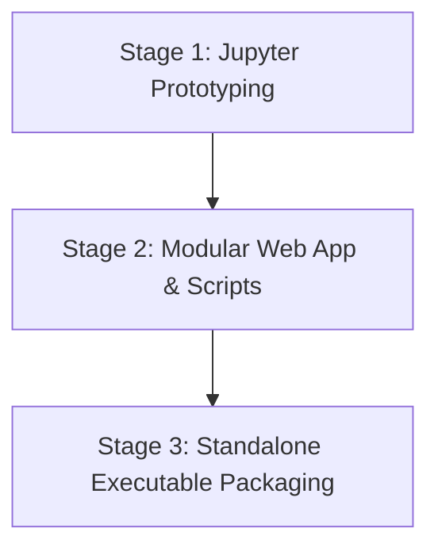
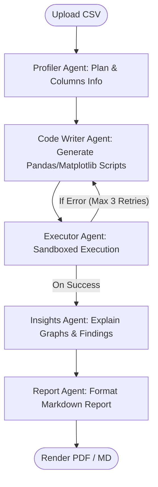

# AI Multi-Agent Data Analysis App 🤖📊

A professional, self-contained desktop application that automates end-to-end data analysis workflows on raw CSV datasets. Built with **FastAPI**, **LangGraph**, and a premium **Vanilla CSS/JS** reactive single-page interface, it orchestrates a specialized multi-agent cascade to profile data, write/sandbox execution scripts, extract insights, and render publication-grade reports.

---

## 🛠️ The 3 Stages of Development

This application was developed progressively across three distinct stages to ensure algorithmic correctness, modular separation, and a friction-free experience for end-users.



---

### Stage 1: Jupyter Notebook Prototyping
The initial phase focused on researching the multi-agent logic, prompt engineering, self-correcting sandboxed code execution loops, and PDF compilation layouts inside a unified interactive environment.

#### File Structure
```text
ai-multi-agent-data-analysis-app/
├── AI multi-agent data-analysis app FREE TIER.ipynb   # Core prototype notebook
└── Languages_of_the_World.csv                         # Test dataset
```

---

### Stage 2: Modular Architecture & Startup Launchers
The prototype was restructured into a production-grade web application with a modular FastAPI backend and an independent responsive frontend SPA. Local command scripts were added for easy startup.

#### File Structure
```text
ai-multi-agent-data-analysis-app/
├── backend/
│   ├── main.py                     # FastAPI server, watchdog, and route endpoints
│   ├── agent_workflow.py           # LangGraph team nodes and tool execution definition
│   └── config.py                   # Local credentials and file-system paths
├── frontend/
│   ├── index.html                  # Responsive client SPA layout
│   ├── styles.css                  # Custom CSS design system variable tokens
│   └── app.js                      # AJAX client pings, visibility handlers, and SSE UI
├── launcher.py                     # Uvicorn bootloader and auto-browser launcher
├── run.bat                         # One-click startup script for Windows
├── run.sh                          # One-click startup script for macOS/Linux
├── requirements.txt                # Python dependencies
└── Languages_of_the_World.csv      # Sample dataset
```

---

### Stage 3: Standalone Executable Packaging
To eliminate local setups for end-users, the app is compiled into a single pre-packaged binary for each specific OS using PyInstaller, complete with a custom startup splash screen and an embedded browser launcher.

#### File Structure
```text
ai-multi-agent-data-analysis-app/
├── releases/
│   ├── AI-DataAnalysisApp-windows.exe  # Standalone Windows binary (pre-compiled)
│   ├── AI-DataAnalysisApp-macos        # Standalone macOS binary (pre-compiled)
│   └── AI-DataAnalysisApp-linux        # Standalone Linux binary (pre-compiled)
├── .github/workflows/
│   └── build-executables.yml       # Multi-platform CI/CD compilation actions pipeline
├── splash.png                      # Outfit font gradient rounded-corner loading splash card
└── launcher.py                     # Compiler entry point
```

---

## ⚡ Quick Start

### Prerequisites
To use the application, you will need:
1. **Google Gemini API Key**: Obtainable from [Google AI Studio](https://aistudio.google.com/api-keys).
2. **LangSmith API Key**: Obtainable from [LangSmith](https://www.langchain.com/langsmith/observability) to track the multi-agent graph cascade in real-time.

---

### Option A: Running the Standalone Executable (Stage 3) - *Recommended*
The easiest way to run the app. No Python installation required.

1. Download the executable matching your OS from the repository's **Releases** tab:
   * **Windows**: `AI-DataAnalysisApp-windows.exe`
   * **macOS**: `AI-DataAnalysisApp-macos`
   * **Linux**: `AI-DataAnalysisApp-linux`
2. **Launch the application**:
   * **Windows**: Double-click `AI-DataAnalysisApp-windows.exe`. A premium loading splash screen will display while the server starts up, and your browser will open to `http://127.0.0.1:8000` automatically.
   * **macOS & Linux**: Open a terminal in the folder containing your downloaded file, make it executable, and run it:
     ```bash
     chmod +x AI-DataAnalysisApp-macos
     ./AI-DataAnalysisApp-macos
     ```

---

### Option B: Running the Source Code (Stage 2)
Best for developers wanting to modify code or run in debug mode.

1. Clone the repository and navigate into the directory:
   ```bash
   git clone https://github.com/ThucDao/ai-multi-agent-data-analysis-app.git
   cd ai-multi-agent-data-analysis-app
   ```
2. Install Python dependencies:
   ```bash
   pip install -r requirements.txt
   ```
3. Run the startup script:
   * **Windows**: Double-click `run.bat` or run it from the command prompt.
   * **macOS & Linux**: Run `./run.sh` (make sure it has execution permissions: `chmod +x run.sh`).

---

### Option C: Running the Prototype Notebook (Stage 1)
For testing individual agent modules interactively.

1. Ensure Jupyter is installed (`pip install jupyterlab`).
2. Start the Jupyter server:
   ```bash
   jupyter lab
   ```
3. Open `AI multi-agent data-analysis app FREE TIER.ipynb` and run the cells sequentially.

---

## 🧠 Multi-Agent Cascade Flow

The core backend uses **LangGraph** to coordinate a self-correcting team of specialized LLM agents. If the compiled Python code crashes, the system automatically redirects the traceback back to the Code Writer to self-correct.



### Detailed Agent Roles & Design
* **Data Profiler Agent (`profiler`)**: Reads the raw CSV schema, automatically infers data types, detects missing values/anomalies, and drafts a structured JSON execution plan containing proposed analysis approaches and visual chart designs.
* **Python Developer Agent (`code_writer`)**: Generates clean, robust Python analytics code using Pandas, Matplotlib, and Seaborn based on the Profiler's plan.
* **Local Code Executor Agent (`executor`)**: Runs the generated python code in a sandboxed subprocess. It captures stdout/stderr logs, writes generated chart PNGs to local workspace directories, and sends stack traces back to the `code_writer` for automatic self-correction if runtime errors occur.
* **Visual Analyst Agent (`insights`)**: Inspects data correlations, generated graphs, and summary statistics to write high-level data findings, business takeaways, and explanations for each visual chart.
* **Report Writer Agent (`report`)**: Consolidates the data profiles, compiled charts, and visual insights into a unified, beautifully styled Markdown report structure.

---

## ✨ Features

* **Zero-Setup Plug & Play**: Standalone executable bundles Python, libraries, DLLs, and Web UI.
* **Self-Correcting Code Loop**: The executor isolates code runtime; if libraries fail or data shapes trigger runtime warnings, the code writer reads tracebacks and corrects itself automatically.
* **Premium Glassmorphic UI**: Vanilla HTML5, CSS Variables, and CSS Grid with light/dark modes and interactive micro-animations.
* **Flexible API Key Storage**: 
  * **Temporary**: Active for this session only; API keys are wiped from the config file when the application is closed.
  * **Permanent**: Saved securely in the user's home folder (`~/.ai_multi_agent_data_analysis/config.json`) for automatic load-in on future launches.
* **Smart Server Lifecycle Guard**: Custom watchdog tracks visibility and closes the FastAPI background process instantly when the user closes their browser tab, preventing orphaned server processes.

---

## 💻 Tech Stack

### Frontend
* **Core Layout**: Semantic HTML5
* **Styling**: Vanilla CSS (CSS Variables, HSL Gradient Grids, Glassmorphism Cards)
* **Interactions**: Native ES6 JavaScript (Fetch API, Live Polling)

### Backend
* **API Framework**: FastAPI (Uvicorn ASGI runner)
* **Agent Flow Orchestration**: LangGraph (LangChain ecosystem)
* **LLM Engine**: Google Gemini API (`gemini-2.5-flash` and `gemini-1.5-pro` configurations)
* **Tracing/Observability**: LangSmith
* **PDF Compilation**: `xhtml2pdf` & `WeasyPrint` (via GTK/Cairo)
* **Build Compiler**: PyInstaller

---

## 🌐 Architectural Decision: Why Local Binary over Web App?

This application is purposefully packaged as a local binary rather than deployed to public cloud services (like Streamlit or Vercel) for two critical reasons:

### 1. Data Privacy and Key Security
Running the multi-agent graph requires entering your **Gemini API Key** and **LangSmith API Key**. Inputting credentials into a public web server raises legitimate security doubts. Running locally keeps your keys and datasets strictly on your local device—they are never sent to a middleman server.

### 2. Native Operating System Dependencies for WeasyPrint
While the default `xhtml2pdf` compiler is fully portable, it lacks support for modern CSS tables. `WeasyPrint` yields publication-quality, print-ready document rendering, but requires native system-level layout libraries. Running locally allows users to easily install these dependencies:

* **macOS**:
  ```bash
  brew install cairo pango
  ```
* **Linux (Debian/Ubuntu)**:
  ```bash
  sudo apt-get install libcairo2 libpango-1.0-0
  ```
* **Windows**:
  The standalone binary handles this automatically by shipping the required pre-compiled DLL dependencies bundled directly inside the executable.
