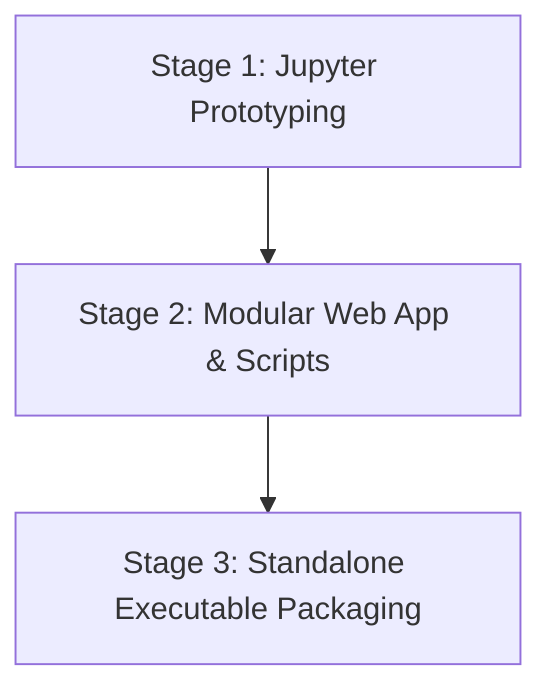

# AI Multi-Agent Data Analysis App

A professional, self-contained desktop application that automates end-to-end data analysis workflows on raw CSV datasets. Built with **FastAPI**, **LangGraph**, and a premium **Vanilla CSS/JS** reactive single-page interface, it orchestrates a specialized multi-agent cascade to profile data, write/sandbox execution scripts, extract insights, and render publication-grade reports.

---

## 📸 Screenshots & Showcase

### 1. Model & API Key Configuration

<br>
*Figure 1: API configuration panel showing model selection and API key inputs*

<br>

### 2. Dataset Importer & PDF Engine Selection

<br>
*Figure 2: Selection of input CSV dataset, export directory, and PDF rendering engine choice*

<br>

### 3. Profiler Agent Execution

<br>
*Figure 3: Profiler Agent actively mapping dataset column types and analysis scope*

<br>

### 4. Code Writer Agent Execution

<br>
*Figure 4: Code Writer Agent generating code for statistical computation and Matplotlib chart creation*

<br>

### 5. Executor Agent Sandbox Run

<br>
*Figure 5: Executor Agent running code in a sandbox, tracking logs, and auto-correcting any errors*

<br>

### 6. Insights Agent Data Interpretation

<br>
*Figure 6: Insights Agent interpreting statistical outputs and writing visual explanations*

<br>

### 7. Report Agent Compilation

<br>
*Figure 7: Report Agent formatting the final markdown document and compiling the layout*

<br>

### 8. Workflow Successfully Completed

<br>
*Figure 8: Analysis workflow fully completed, displaying processing time and run log*

<br>

### 9. Post-Run Action Panel

<br>
*Figure 9: Post-run UI actions showing PDF export button, markdown viewer button, and a LangSmith trace shortcut*

<br>

### 10. Integrated Markdown Viewer

<br>
*Figure 10: Integrated Markdown toggle viewer showing formatted document tables and text within the UI*

<br>

### 11. LangSmith Runs Dashboard

<br>
*Figure 11: LangSmith dashboard showing trace latency, token costs, and node executions*

<br>

### 12. LangSmith Execution Waterfall View

<br>
*Figure 12: LangSmith waterfall view displaying the step-by-step agent node latency breakdown*

<br>

📄 **[Download the PDF report generated with WeasyPrint engine.](./artifacts/run%2046_paid%20tier_gemini%203.1%20pro_weasyprint/report_2026-07-14_23.29.24.pdf)**

---

## 🛠️ The 3 Stages of Development

This application was developed progressively across three distinct stages to ensure algorithmic correctness, modular separation, and a friction-free experience for end-users.



---

### Stage 1: Jupyter Notebook Prototyping
The initial phase focused on researching the multi-agent logic, prompt engineering, self-correcting sandboxed code execution loops, and PDF compilation layouts inside a unified interactive environment.

#### File Structure
```text
ai-multi-agent-data-analysis-app/
├── AI multi-agent data-analysis app FREE TIER.ipynb   # Core prototype notebook
├── AI multi-agent data-analysis app PAID TIER.html    # HTML export showing prototype run results
└── Languages_of_the_World.csv                         # Test dataset
```

*Note: The `.html` file was manually exported to give users an immediate view of the analysis outputs after running all code cells in the prototype notebook. The only difference between them is:*
* *`.ipynb` file: configures the `gemini-3.5-flash` model under the Free Tier.*
* *`.html` file: represents the execution results of the notebook run using the `gemini-3.1-pro-preview` model under the Paid Tier.*

---

### Stage 2: Modular Architecture & Startup Launchers
The prototype was restructured into a production-grade web application with a modular FastAPI backend and an independent responsive frontend SPA. Local command scripts were added for easy startup.

#### File Structure
```text
ai-multi-agent-data-analysis-app/
├── backend/
│   ├── main.py                     # FastAPI server, watchdog, and route endpoints
│   ├── agent_workflow.py           # LangGraph team nodes and tool execution definition
│   └── config.py                   # Local credentials and file-system paths
├── frontend/
│   ├── index.html                  # Responsive client SPA layout
│   ├── styles.css                  # Custom CSS design system variable tokens
│   └── app.js                      # AJAX client pings, visibility handlers, and SSE UI
├── launcher.py                     # Uvicorn bootloader and auto-browser launcher
├── run.bat                         # One-click startup script for Windows
├── run.sh                          # One-click startup script for macOS/Linux
├── requirements.txt                # Python dependencies
└── Languages_of_the_World.csv      # Sample dataset
```

---

### Stage 3: Standalone Executable Packaging
To eliminate local setups for end-users, the app is compiled into a single pre-packaged binary for each specific OS using PyInstaller, complete with a custom startup splash screen and an embedded browser launcher.

*Note: PyInstaller compiles binaries natively for the host OS (so compiling a Windows executable requires a Windows host, macOS requires macOS, and Linux requires Linux). Since compiling all three local binaries would require owning three different physical computers, this project utilizes a custom GitHub Actions CI/CD build matrix workflow. This compiles and packages the desktop executables for Windows, macOS, and Linux in parallel automatically upon tagging a release.*

#### File Structure
```text
ai-multi-agent-data-analysis-app/
├── .github/workflows/
│   └── build-executables.yml       # Multi-platform CI/CD compilation actions pipeline
├── splash.png                      # Outfit font gradient rounded-corner loading splash card
└── launcher.py                     # Compiler entry point
```

*Note on Executables: The three compiled executable files are not tracked in the git history due to file size limits. Instead, they are generated automatically by the GitHub Actions compilation workflow and released as build artifacts under the **Actions** tab (inside the specific run's **Artifacts** section at the bottom of the page), or published as downloads on the repository's **Releases** page.*

---

## 📂 Additional Project Files & Directories
While not part of the active development code in the three stages, you may see these other files and folders in the repository root. Here is what they are and why they are valuable:

```text
ai-multi-agent-data-analysis-app/
├── artifacts/                      # Chart images, Markdown and PDF reports generated by this app
├── docs/                           # Planning and walkthrough documents for Stage 2 development
├── screenshots/                    # UI captures and LangGraph console photos
├── LICENSE                         # MIT License documentation outlining your permission to use/modify the code
├── .gitattributes                  # System configuration telling Git how to handle line endings and binary files
└── .gitignore                      # Git configuration file specifying which untracked files to ignore
```

---

## ⚡ Quick Start

### Prerequisites
To use the application, you will need:
1. **Google Gemini API Key**: Obtainable from [Google AI Studio](https://aistudio.google.com/api-keys). *(Note: If you plan to use any Pro models of Gemini, your Google AI Studio account must have billing set up and activated).*
2. **LangSmith API Key**: Obtainable from [LangSmith](https://www.langchain.com/langsmith/observability) to track the multi-agent graph cascade in real-time.

---

### Option A: Running the Standalone Executable (Stage 3) - *Recommended*
The easiest way to run the app. Absolutely zero setup or installation is required—no Python runtime setup or external layout engine dependencies are needed, as all requirements are fully pre-packaged directly inside the executable.

1. **Download the executable matching your OS**:
   * Go to the repository's main page on GitHub.
   * On the right-hand sidebar, locate the **Releases** section (or go directly to **[https://github.com/ThucDao/ai-multi-agent-data-analysis-app/releases](https://github.com/ThucDao/ai-multi-agent-data-analysis-app/releases)**).
   * Click on the latest release tag (e.g. `v1.0`), expand the **Assets** section if hidden, and download the binary file for your OS:
     * **Windows**: `AI-DataAnalysisApp-windows.exe`
     * **macOS**: `AI-DataAnalysisApp-macos`
     * **Linux**: `AI-DataAnalysisApp-linux`
2. **Launch the application**:
   * **Windows**: Double-click `AI-DataAnalysisApp-windows.exe`. A premium loading splash screen will display while the server starts up, and your browser will open to `http://127.0.0.1:8000` automatically.
   * **macOS & Linux**: Open a terminal in the folder containing your downloaded file, make it executable, and run it:
     ```bash
     chmod +x AI-DataAnalysisApp-macos
     ./AI-DataAnalysisApp-macos
     ```

---

### Option B: Running the Source Code (Stage 2)
Best for developers wanting to modify code or run in debug mode.

**System Requirements**: **Python 3.10 or higher** must be installed on your local machine and added to your system's **PATH** environment variable.

1. Clone the repository and navigate into the directory:
   ```bash
   git clone https://github.com/ThucDao/ai-multi-agent-data-analysis-app.git
   cd ai-multi-agent-data-analysis-app
   ```
2. Run the startup script (this automatically initializes the virtual environment, checks dependencies, and launches the application):
   * **Windows**: Double-click `run.bat` or run it from the command prompt.
   * **macOS & Linux**: Run `./run.sh` (ensure execution permission is granted with `chmod +x run.sh`).

---

### Option C: Running the Prototype Notebook (Stage 1)
For testing individual agent modules interactively.

1. Ensure Jupyter is installed (`pip install jupyterlab`).
2. Start the Jupyter server:
   ```bash
   jupyter lab
   ```
3. Open `AI multi-agent data-analysis app FREE TIER.ipynb` and run the cells sequentially.

---

## 🧠 Multi-Agent Cascade Flow

The core backend uses **LangGraph** to coordinate a self-correcting team of specialized LLM agents. If the compiled Python code crashes, the system automatically redirects the traceback back to the Code Writer to self-correct.


### Detailed Agent Roles & Design
* **Data Profiler Agent (`profiler`)**: Reads the raw CSV schema, automatically infers data types, detects missing values/anomalies, and drafts a structured JSON execution plan containing proposed analysis approaches and visual chart designs.
* **Python Developer Agent (`code_writer`)**: Generates clean, robust Python analytics code using Pandas, Matplotlib, and Seaborn based on the Profiler's plan.
* **Local Code Executor Agent (`executor`)**: Runs the generated python code in a sandboxed subprocess. It captures stdout/stderr logs, writes generated chart PNGs to local workspace directories, and sends stack traces back to the `code_writer` for automatic self-correction if runtime errors occur.
* **Visual Analyst Agent (`insights`)**: Inspects data correlations, generated graphs, and summary statistics to write high-level data findings, business takeaways, and explanations for each visual chart.
* **Report Writer Agent (`report`)**: Consolidates the data profiles, compiled charts, and visual insights into a unified, beautifully styled Markdown report structure.

---

## ✨ Features

* **Zero-Setup Plug & Play**: Standalone executable bundles Python, libraries, DLLs, and Web UI.
* **Self-Correcting Code Loop**: The executor isolates code runtime; if libraries fail or data shapes trigger runtime warnings, the code writer reads tracebacks and corrects itself automatically.
* **Premium Glassmorphic UI**: Vanilla HTML5, CSS Variables, and CSS Grid with light/dark modes and interactive micro-animations.
* **Flexible API Key Storage**: 
  * **Temporary**: Active for this session only; API keys are wiped from the config file when the application is closed.
  * **Permanent**: Saved securely in the user's home folder (`~/.ai_multi_agent_data_analysis/config.json`) for automatic load-in on future launches.
* **Smart Server Lifecycle Guard**: Custom watchdog tracks visibility and closes the FastAPI background process instantly when the user closes their browser tab, preventing orphaned server processes.

---

## 💻 Tech Stack

### Frontend
* **Core Layout**: Semantic HTML5
* **Styling**: Vanilla CSS (CSS Variables, HSL Gradient Grids, Glassmorphism Cards)
* **Interactions**: Native ES6 JavaScript (Fetch API, Live Polling)

### Backend
* **API Framework**: FastAPI (Uvicorn ASGI runner)
* **Agent Flow Orchestration**: LangGraph (LangChain ecosystem)
* **LLM Engine**: Google Gemini API (`gemini-2.5-flash` and `gemini-1.5-pro` configurations)
* **Tracing/Observability**: LangSmith
* **PDF Compilation**: `xhtml2pdf` & `WeasyPrint` (via GTK/Cairo)
* **Build Compiler**: PyInstaller

---

## 🌐 Architectural Decision: Why Local Binary over Web App?

This application is purposefully packaged as a local binary rather than deployed to public cloud services (like Streamlit or Vercel) for two critical reasons:

### 1. Data Privacy and Key Security
Running the multi-agent graph requires entering your **Gemini API Key** and **LangSmith API Key**. Inputting credentials into a public web server raises legitimate security doubts. Running locally keeps your keys and datasets strictly on your local device—they are never sent to a middleman server.

### 2. Native Operating System Dependencies for WeasyPrint
While `xhtml2pdf` is lightweight and easy to deploy as a pure-Python package, it has limited support for modern CSS features and complex table layouts. 
In contrast, `WeasyPrint` produces high-fidelity, publication-quality PDFs with significantly better HTML/CSS rendering, but it depends on several native system libraries, such as Cairo, Pango, and GLib/GObject.

These dependencies are straightforward to install on desktop operating systems (for example, via Homebrew on macOS or Apt on Debian/Ubuntu), but they can complicate deployment on shared-hosting or serverless platforms where installing native libraries or custom runtimes is restricted.
Packaging the application for local execution allows users to install these dependencies natively (see below) and take advantage of WeasyPrint's superior rendering quality.

* **macOS**:
  ```bash
  brew install cairo pango gobject-introspection
  ```
* **Linux (Debian/Ubuntu)**:
  ```bash
  sudo apt-get install libcairo2 libpango-1.0-0
  ```
* **Windows**:
  The standalone binary handles this automatically by shipping the required pre-compiled DLL dependencies bundled directly inside the executable.

---

## 📄 License

This project is licensed under the MIT License - see the [LICENSE](LICENSE) file for details.
