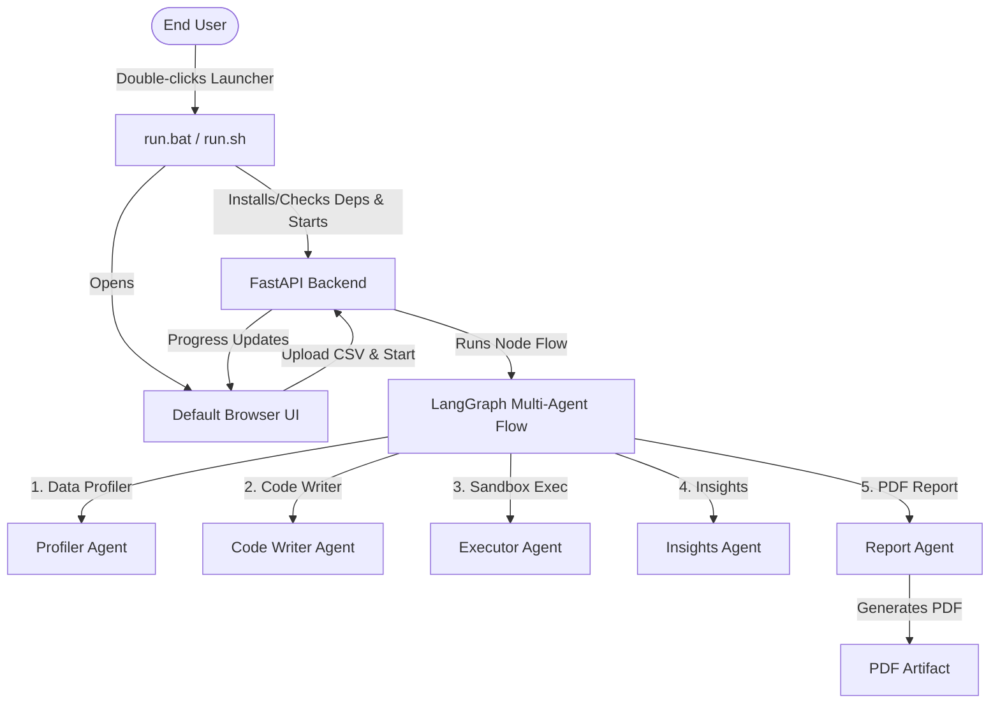

# Implementation Plan - Multi-Agent Data Analysis Desktop Application

Transition the prototyping code in the Jupyter Notebook "AI multi-agent data-analysis app FREE TIER.ipynb" into a fully interactive, cross-platform desktop application using a local **FastAPI** backend and a premium, responsive **HTML/JS/CSS** frontend.

## User Review Required

> [!IMPORTANT]
> **No Docker Required**: We will run the application natively via a Python virtual environment and a local web server that automatically opens in the user's web browser. This ensures maximum compatibility and low system resource overhead.
>
> **API Key Storage**: API keys (`GEMINI_API_KEY`, `LANGSMITH_API_KEY`) will be stored securely in the user's home directory (`~/.ai_multi_agent_data_analysis/config.json`) with owner-only access permissions (`chmod 600` on macOS/Linux). They will not be stored in environment variables, protecting them from global exposure.
>
> **Double-Click Launchers**: We will provide a `run.bat` for Windows and a `run.sh` for macOS/Linux to let users double-click and run the application without typing command-line instructions.

## Proposed Architecture

---

## Proposed Changes

### [Backend Component]

#### [NEW] config.py
Implements secure cross-platform reading and writing of credentials to `~/.ai_multi_agent_data_analysis/config.json` with user-restricted permissions.

#### [NEW] agent_workflow.py
Houses the LangGraph agent state schema, tool definitions, agent node functions (data-profiling, code-writer, sandbox-executor, insights-writer, report-builder), and the graph execution loop.
- **Modifications**: Integrates progress tracking hooks so that frontend clients can fetch current status (e.g. which agent is active, logs, errors).
- **Error Handling**: Captures execution and API issues and reports them in plain language.

#### [NEW] main.py
FastAPI application that serves:
- REST endpoints for checking/saving API keys, uploading the CSV dataset, initiating the analysis run, polling current run progress, and opening the generated PDF.
- Static files from the frontend directory.

---

### [Frontend Component]

#### [NEW] index.html
A modern, single-page application structure featuring:
- A responsive layout with a sleek Glassmorphism dark mode design.
- File selection box (1 CSV file) and Browse button.
- Tier selection (Free/Paid) and secure API key fields.
- Interactive progress visualization (agents involved, active agent, live text logs).
- Post-run actions: link to open LangSmith dashboard, instructions, Markdown toggle viewer, and open PDF button.

#### [NEW] styles.css
Custom premium styling using Outfit/Inter fonts, HSL gradients, glassmorphism card layouts, subtle hover micro-animations, progress indicators, and responsive flex/grid layouts for various screen sizes (laptop and desktop).

#### [NEW] app.js
Frontend logic that:
- Queries key configuration status on load.
- Saves keys asynchronously and hides them from the UI fields.
- Uploads the selected CSV file.
- Triggers graph execution.
- Polls the backend status endpoint every 500ms to update progress bars, current active agent states, and log messages.
- Displays report contents and calls the backend to open the PDF.

---

### [Launchers & Metadata]

#### [NEW] requirements.txt
Specifies dependencies: `google-genai`, `langgraph`, `langsmith`, `pydantic`, `pandas`, `matplotlib`, `markdown2`, `weasyprint`, `markdown-it-py`, `mdit-py-plugins`, `fastapi`, `uvicorn`, `python-multipart`.

#### [NEW] run.bat
Windows batch launcher:
- Checks if Python is installed.
- Creates/activates virtual environment (`.venv`).
- Installs requirements.
- Starts backend server and launches browser.

#### [NEW] run.sh
macOS/Linux shell script (equivalent to `run.bat`).

---

## Verification Plan

### Automated Tests
- We will write a validation script `verify_env.py` to confirm the backend runs correctly and loads local API keys without error.

### Manual Verification
- **Credential Storage**: Confirm pasting keys writes to the user home folder config and masks the UI text boxes.
- **Workflow Execution**: Run a full analysis on the sample `Languages_of_the_World.csv` file:
  - Verify progress updates show each agent ("Profiler", "Code Writer", etc.) transitioning state in the UI.
  - Verify that if code errors out, retry logic handles it, or final failure shows an understandable message.
  - Verify that toggling the Markdown report shows findings, and clicking "Open PDF" launches the system's default PDF viewer.
  - Verify opening the LangSmith dashboard opens the correct URL.
